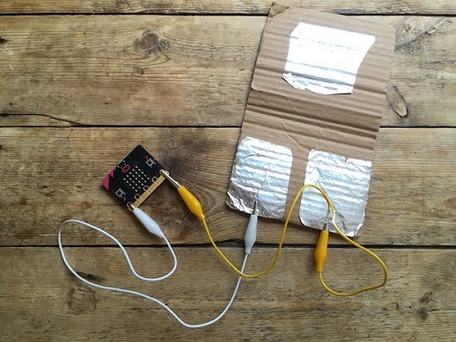

micro:bit Wireless Intruder Alarm
--------------------
In this assignment you will work with a partner to program two micro:bits to create a wireless intruder alarm that will warn you when someone steps on a home-made pressure sensor.

Start by choosing a partner. One person will program their micro:bit to act as the sending device that is triggered by the pressure sensor. The other person will program the receiver that activates the alarm. The alarm could use the speaker to create a sound, trigger an LED, or even activate a servo to "whack" the intruder. In both programs you will need to set the group to the same number from 0 to 255.

Program requirements
-----------------
* Your program must use the micro:bit's radio features
* Each person will submit the Python code for their program (either the sender or receiver) and an animated gif showing the two programs running to Google Classroom

Build the Pressure Sensor
----------
Cut out a small piece of cardoard and fold it in half. Glue two squares of tin foil on one side of the fold, and a third on the other so that when the cardboard is folded the tin foil completes the circuit. Connect pin 0 and ground to the sensor as shown below:   

Write the sending code on one micro:bit
----------
1. Add `import radio` to the top of your program
2. Add `radio.on()` and `radio.config(group = `*some number*`)` before the `while True:`. For the group number, choose a number between 0 and 255
3. Inside of the `while True:` write an `if` statement using `pin0.read_analog()` to detect when the pressure switch is closed. The reading will be between 0 and 1027. If the switch is closed, the reading will be a low number. If the switch is open, the reading will be a high number. If the switch is closed, send a message using `radio.send("a message")`

Write the receiving code on the other micro:bit
----------
1. Add `import radio` to the top of your program
2. Add `radio.on()` and `radio.config(group = `*some number*`)` before the `while True:`. For the group number, be sure to use the same group number as the sending code
3. Inside of the `while True:` write an `if` statement using `radio.receive()`. If the the message is received, trigger the alarm.

Extensions
----------
If you have extra time, you can add multiple sensors each sending its own message, e.g. ‘room1’, ‘room2’ and have the alarm show where the intruder is. You could also try different designs for the pressure switch. For example, place a foam pad inside it if is being triggered too easily.
You could also make a rain alarm using two tin foil pads very close together – if they get wet, they will trigger the alarm. Be sure not to get your micro:bit wet though! Have fun and be creative, your alarm doesn't have to work like any other.

Samples of Student Work
----------
*none yet!*
